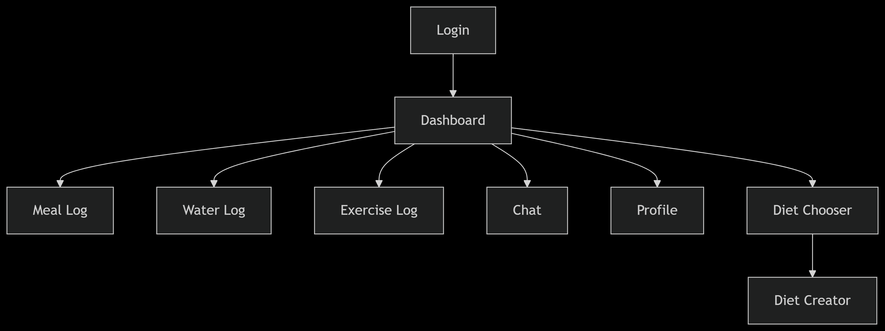

# Diet Planner - Personalized Nutrition App 🥗


###  
#### https://github.com/SebastianBenjamin/DietPlanner
###   

## 📝 Table of Contents

- [About](#-about)
- [Development Team](#-development-team)
- [Key Features](#-key-features)
- [Technology Stack](#-technology-stack)
- [System Requirements](#-system-requirements)
- [Installation Guide](#-installation-guide)
- [Database Configuration](#-database-configuration)
- [Application Deployment](#-application-deployment)
- [Project Architecture](#-project-architecture)
<<<<<<< HEAD
- [App Navigation Guide](#-app-navigation-guide)


=======
>>>>>>> d3465ebd9eb85c31b705fb316532be3c17038c89

## 🌟 About

Diet Planner is a **Spring-Hibernate** based web application that revolutionizes personal nutrition management. This comprehensive solution combines intelligent diet planning with habit tracking and AI-powered guidance to help users achieve their health goals.


**Core Value Proposition:**
- 🎯 Personalized nutrition planning tailored to individual needs
- 📈 Comprehensive progress tracking with actionable insights
- 🤖 Intelligent AI assistant for real-time nutrition guidance
- 📱 Responsive design for seamless cross-device experience

## 👨‍💻 Development Team
<<<<<<< HEAD

=======
>>>>>>> d3465ebd9eb85c31b705fb316532be3c17038c89
### Core Contributors

| Name | GitHub | Contributions |
|------|--------|---------------|
| Akshay Venugopalan | [@akshayvenu](https://github.com/akshayvenu) | Logging systems, AI chatbot integration |
| Benjamin Sebastian | [@SebastianBenjamin](https://github.com/SebastianBenjamin) | Dashboard UI, diet management, streak logic |
| Shravya Salian | [@salianShravya](https://github.com/salianShravya) | Authentication system, UI components |

<<<<<<< HEAD

## ✨ Key Features
=======
## ✨ Key Features  
>>>>>>> d3465ebd9eb85c31b705fb316532be3c17038c89

### 🍽️ Diet Planning Module

| Feature | Description |
|---------|-------------|
| Custom Diet Creation | Build personalized plans with custom meal frequencies and preferences |
| Predefined Templates | Choose from professionally designed diet templates |
| Nutritional Targets | Set daily calorie, protein, and water intake goals |
### 📊 Health Tracking System

| Component | Capabilities |
|-----------|--------------|
| Meal Logger | Track meal completion status with visual indicators |
| Water Tracker | Monitor daily hydration with goal progress |
| Exercise Log | Record workout sessions and intensity levels |
| Streak System | Motivation through achievement streaks and milestones |

### 🤖 AI Nutrition Assistant
- Natural language processing for nutrition queries
- Context-aware recommendations
- Quick-access templates for common questions
- Personalized feedback based on user data

### 🎨 User Experience
- Modern dashboard with at-a-glance metrics
- Intuitive navigation and workflow
- Responsive design optimized for all devices
- Visual data representations for easy interpretation
## 💻 Technology Stack

### Backend Infrastructure


### Frontend Ecosystem


### Development Tools


  

## ⚙️ System Requirements

**Minimum Specifications:**
- Java Development Kit 17+
- Apache Tomcat 10.x
- MySQL Server 8.0+ or XAMPP
- Maven 3.8+
- Modern web browser (Chrome, Firefox, Edge)

## 🛠️ Installation Guide
1. **Clone the Repository**

   ```bash
   git clone https://github.com/SebastianBenjamin/DietPlanner.git
   cd DietPlanner
   ```

2. **Configure Application Properties**
  - Update database connection parameters in:

    ```
    src/main/resources/hibernate.cfg.xml
    ```

3. **Build Dependencies**

   ```bash
   mvn clean install
   ```

## 🗃️ Database Configuration

1. **Initialize MySQL Database**

   ```sql
   CREATE DATABASE dietplanner ;
   ```

  

2. **Import Schema**
   ```bash
   mysql -u [username] -p dietplanner < dietplanner.sql
   ```

## 🚀 Application Deployment

**Tomcat Deployment Steps:**
1. Build the WAR package:

   ```bash
   mvn clean package
   ```
   
2. Deploy to Tomcat:
  - Copy `target/DietPlanner.war` to `[TOMCAT_HOME]/webapps/`
  - Start Tomcat server
  
3. Access application:

   ```
   http://localhost:8080/DietPlanner/
   ```

## 🏗️ Project Architecture


```
DietPlanner/
├── src/
│   ├── main/
│   │   ├── java/org/                     
│   │   │   ├── classFiles/             # Domain models and business logic
│   │   │   │   ├── User.java          # User entity
│   │   │   │   ├── Diet.java          # Diet plan entity
│   │   │   │   ├── LogData.java       # Log data Entity
│   │   │   │   └── Services.java      # Core business services
│   │   │   └── Controllers/           # MVC controllers
│   │   │       └── Controller.java    # Main application controller
│   │   ├── resources/                
│   │   │   └── hibernate.cfg.xml      # ORM configuration
│   │   └── webapp/                    
│   │       ├── WEB-INF/views/         # View templates (JSP)
│   │       └── static/                # Static assets (CSS/JS/images)
├── pom.xml                            # Build configuration
└── dietplanner.sql                    # Database schema
```
## 🌐 App Navigation Guide

<<<<<<< HEAD
The Diet Planner application includes several key pages with interactive UI elements that trigger specific endpoints. Below is a comprehensive navigation map showing both pages and their associated actions:

| Page | UI Element/Action                 | Triggered Endpoint | Description |
|------|-----------------------------------|-------------------|-------------|
| **Dashboard** | Page Load                         | `/dashboard` | Main page showing current diet plan, daily salad recommendation, and tracking summary |
| | "Choose a diet" link              | `/dietmanager?c=1` | Navigate to diet selection page |
| | "Make a Diet" link                | `/dietmanager?c=0` | Navigate to custom diet creation page |
| | "Cancel Diet" button              | `/cancelDiet` (POST) | Remove current diet plan |
| | "Meal Log" link                   | `/mealLog` | Navigate to meal tracking page |
| | "Water Log" link                  | `/waterLog` | Navigate to water intake tracking page |
| | "Exercise Log" link               | `/exerciseLog` | Navigate to exercise tracking page |
| | "Nutri Mate" button               | `/chat` | Open nutrition assistant chatbot |
| **Diet Chooser** | Page Load                         | `/dietmanager?c=1` | Display available diet plans |
| | "Select" button                   | `/selectDiet` (POST) | Choose specific diet plan |
| | "Create Custom Diet" link         | `/dietmanager?c=0` | Navigate to diet creation page |
| **Diet Maker** | Page Load                         | `/dietmanager?c=0` | Show diet creation form |
| | "Create Diet Plan" button         | `/makeDiet` (POST) | Submit custom diet information |
| **Meal Log** | Page Load                         | `/mealLog` | Show meal tracking interface |
| | "Mark Complete/Incomplete" button | `/updateMeal` (POST) | Update meal status |
| **Water Log** | Page Load                         | `/waterLog` | Show water tracking interface |
| | Water amount buttons              | `/addWaterLog` (POST) | Add specific water amount |
| | "Reset Today's Water Log" button  | `/resetWaterLog` (POST) | Clear today's water intake data |
| **Exercise Log** | Page Load                         | `/exerciseLog` | Show exercise tracking interface |
| | "Update Status" button            | `/updateExercise` (POST) | Update exercise completion status |
| **User Management** | "Profile" icon                    | `/profile` | View user profile information |
| | "Logout" button                   | `/logout` | End user session |
### 🔄 Navigation Flow Summary

=======
>>>>>>> d3465ebd9eb85c31b705fb316532be3c17038c89
---
  
💡 **Pro Tip:** For optimal results, use the application consistently to benefit from the streak system and receive increasingly personalized recommendations from our AI nutrition assistant, Nutri Mate!

  


